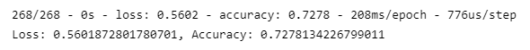
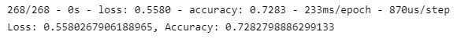
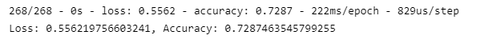

# Neural Network Charity Analysis 
## Overview 
In this challenge we are working for a foundation and what to analze the impact of each donation to ensure the foundation's money is being utilized to its best ability. 

By applying Python's Tensorflow machine learning library, we could use a neural network to predict the likelyhood of success for potential clients 

We created a base model and iterated on the model to improve it's accuracy. 

## Results 
### Data Processing
- Our considered target is the <mark>IS_SUCCESSFUL</mark> column in the dataset
- Variables considered as the features: EIN, NAME, APPLICATION_TYPE, AFFILIATION, CLASSIFICATION, USE_CASE, ORGANIZATION, STATUS, INCOME_AMT, SPECIAL_CONSIDERATIONS, ASK_AMT
- VARIABLES not considered: EIN, NAME
    - Later Removed SPEICAL_CONSIDERATIONS

### Compiling, Training, and Evaluation the Model 
- **Attempt 1**
    - Removed SPECIAL_CONSIDERATIONS as I felt it did not have any meaning impact on the data
    - 2 Hidden Layers
    - 8 neurons (Layer 1), 5 neurons (Layer 2)
    - 
- **Attempt 2**
    - Used activation function *"tanh"*
    - 2 Hidden Layers
    - 8 neurons (Layer 1), 5 neurons (Layer 2)
    - 
- **Attempt 3**
    - Increased neurons and hidden layers
    - 3 Hidden Layers
    - 100 neurons (Layer 1), 50 neurons (Layer 2), 25 neurons (Layer 3)
    - 

### Summary
After the three attempts, I was unable to achieve the targeted accuracy of 75%. The highest attempt was achieved by adding more neurons and hidden layers (72.87%).

Since this data is tabular, I would suggest trying to use a the "Random Forest Classifier" which maybe work well this this relatively smaller dataset and reduce overfitting. 

